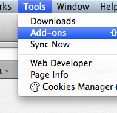

# Se Preparando Para Desenvolver Apps Para Firefox OS

Para construir e testar apps feitos para Firefox OS você não precisa de nada além de uma versão recente do Firefox, do complemento chamado Firefox OS Simulator e um bom editor de texto para programação[^editores].

[^editores]: Existem vários editores bons com diferentes graus de complexidade e funcionalidades. Um muito popular que eu recomendo para quem ainda não possui um editor favorito é o [SublimeText](http://sublimetext.com/). Pessoalmente eu utilizo o [WebStorm](http://www.jetbrains.com/webstorm/) que é uma IDE completa para criação de web apps.

## Obtendo o Firefox

Diferentes navegadores possuem diferentes motores de renderização e execução de JavaScript. O Google Chrome, o Opera e o Safari utilizam o motor conhecido como WebKit (ou Blink que é um fork do WebKit), o Firefox utiliza o motor chamado Gecko tanto no desktop como no Android e no Firefox OS portanto para desenvolver apps para Firefox OS é melhor utilizar o Firefox para Desktop pois ambos utilizam o mesmo sistema de renderização e execução de JavaScript.

Além disso, a Mozilla disponibiliza um simulador do Firefox OS que funciona como um complemento do Firefox portanto, é necessário instalar o Firefox para desktop para poder rodar o simulador do Firefox OS.

A versão estável atual do Firefox pode ser [obtida nessa página](http://getfirefox.com) e então basta seguir as instruções para instalar no seu sistema operacional preferido.

## Instalando o Simulador do Firefox OS

Após a instalação do Firefox, o próximo passo é a instalação do simulador do Firefox OS que será utilizado para testarmos nossos aplicativos. Com o Firefox instalado e rodando, vá no menu **Ferramentas** e selecione **Complementos**[^tools-add-ons] como pode ser visto na imagem abaixo:

[^tools-add-ons]: Caso seu sistema esteja em ingles procure o menu **Tools** e então **Add-ons**.

Utilizando a ferramenta de busca presente no canto superior direito, procure por **firefox os simulator** e instale o simulador.

Após o complemento ser instalado, ele estará disponível no menu **Ferramentas -> Desenvolvedor Web -> Simulador do Firefox OS**

## Conclusão

Agora que temos todos o ambiente preparado vamos aprender uns conceitos básicos para então construirmos nosso primeiro app.